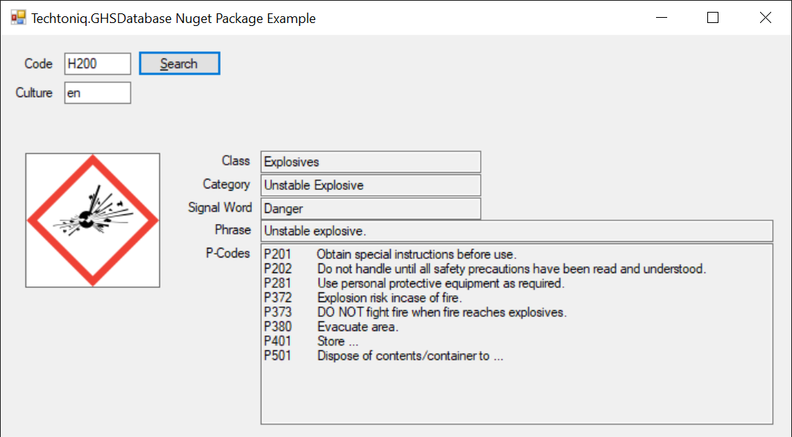

# GHSDatabase

[](https://dev.azure.com/techtoniq/GHS%20Database/_build/latest?definitionId=36&branchName=master)  [](https://sonarcloud.io/dashboard?id=GHS) [](https://dev.azure.com/techtoniq/GHS%20Database/_packaging?_a=package&feed=28bc8d4d-7b39-4f58-afa4-38c3b985a4a8&package=5300b000-23d5-410f-aef5-5af372994475&preferRelease=true)

GHS is the [Globally Harmonised System (GHS)](https://www.hse.gov.uk/chemical-classification/legal/background-directives-ghs.htm) for chemical hazard classification. 

This Nuget package provides an in-memory database of hazard codes, phrases, pictograms, labels and other data from GHS.


## Example Usage

```c#
    IGhsDatabase db = new GhsDatabase();
    IList<IHazard> hazards = db.Get(uxTextCodeValue.Text, uxTextCultureValue.Text);

    if (hazards.Any())
    {
        // Show the first match as an example.

        MemoryStream ms = new MemoryStream(hazards[0].PictogramImage);
        uxPictureHazardPictogram.Image = Image.FromStream(ms);
        uxPictureHazardPictogram.SizeMode = PictureBoxSizeMode.StretchImage;

        uxTextClassValue.Text = hazards[0].Class;
        uxTextCategoryValue.Text = string.Join(", ", hazards[0].Categories);
        uxTextSignalWordValue.Text = hazards[0].SignalWord;
        uxTextPhraseValue.Text = hazards[0].Phrase;

        StringBuilder pcodeStatement = new StringBuilder();
        foreach (var pcode in hazards[0].PCodes)
        {
            pcodeStatement.AppendLine($"{pcode.Code}\t{pcode.Phrase}");
        }
        uxTextPCodesValue.Text = pcodeStatement.ToString();
    }
    else
    {
        uxPictureHazardPictogram.Image = null;
        uxTextClassValue.Text = string.Empty;
        uxTextCategoryValue.Text = string.Empty;
        uxTextSignalWordValue.Text = string.Empty;
        uxTextPhraseValue.Text = string.Empty;
        uxTextPCodesValue.Text = string.Empty;
    }
```

